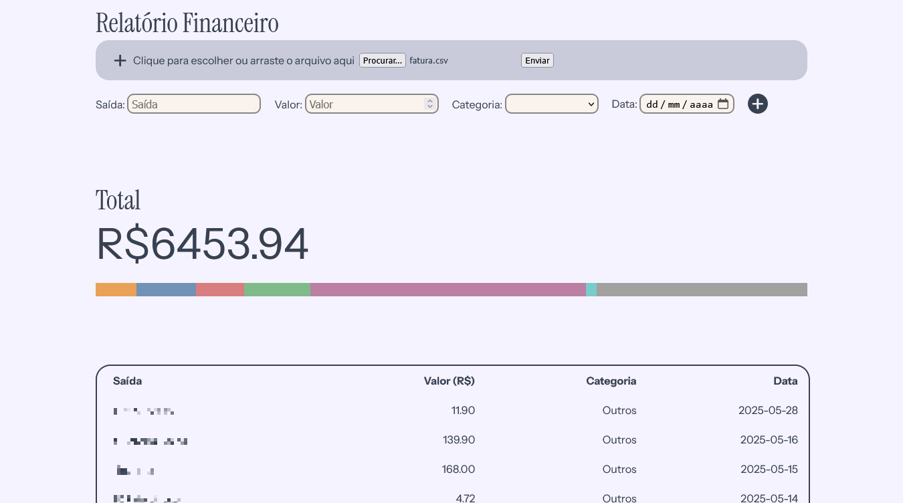

# Planner Financeiro



## Sobre o projeto

O **Planner Financeiro** é uma aplicação criada para ajudar no planejamento financeiro pessoal. A ideia é reunir, em um só lugar, o controle de gastos, o histórico de meses anteriores e uma análise inteligente sobre se vale a pena (ou não) fazer determinada compra.

## Páginas planejadas

### Relatório (*em desenvolvimento no momento*)
Página principal, onde os dados financeiros são inseridos e visualizados. Funcionalidades já implementadas:
- Cadastro de gastos via upload de arquivo CSV (em formato específico) ou inserção manual pelo usuário
- Tabela de gastos com: **nome**, **data**, **valor** e **categoria**
- Soma total dos gastos exibida acima da tabela
- Gráfico de barras horizontais mostrando quanto foi gasto em cada categoria
**Problemas conhecidos / limitações atuais:**
- Ainda não é possível editar um gasto já cadastrado
- Gastos importados via CSV não permitem definição de categoria, ficando presos na categoria "Outros"

### Meses anteriores
Página para consultar tabelas e estatísticas de meses já registrados, permitindo comparar o histórico financeiro ao longo do tempo. *(ainda não implementada)*

### Analisar gasto
Com base nas informações fornecidas pelo usuário (custo de vida, gastos médios mensais, salário, etc.), essa página vai analisar uma compra escolhida pelo usuário e ajudar a responder perguntas como:
- É uma compra razoável no momento?
- Seria melhor esperar e comprar mais tarde?
- Vale mais a pena pagar à vista ou parcelar?
*(ainda não implementada — dependerá dos gastos já cadastrados e da renda mensal informada pelo usuário)*

## Tecnologias

- Node.js
- [papaparse](https://www.npmjs.com/package/papaparse) — leitura e processamento dos arquivos CSV
- [Vite](https://vitejs.dev/) — ambiente de desenvolvimento

## Instalação

```bash
git clone https://github.com/isadorara/Planner_Financeiro.git
cd Planner_Financeiro
npm install
```

## Executando o projeto
 
```bash
npm run dev
```

## Autoria

Desenvolvido por **Isadora Araújo**.